# 1. AWS Code Deploy로 배포하기

AWS로 전체 시스템 구축해야 할 일이 생겨 AWS 배포 환경 시리즈를 시작합니다.  
시리즈 과정은 CodeDeploy -> Code Pipeline -> ELB & Auto Scaling Group -> Beanstalk 으로 진행될 예정입니다.  
  
> Code Pipeline vs Beanstalk 비교가 목표입니다.

포스팅에서 사용된 코드는 모두 [Github](https://github.com/jojoldu/springboot-deploy)에 있습니다.  
  
> 여기서 사용되는 모든 과정은 **프리 티어라도 비용이 청구**될수 있습니다.  
비용에 관한 어떠한 책임도 여기서 책임지지 않으니 주의해주세요!  
프리티어 내에서 완전 무료로 AWS 배포를 경험하고 싶으시다면 [이전 포스팅](http://jojoldu.tistory.com/265)을 참고하시길 추천드립니다.  

처음 과정은 단순하게 AWS Code Deploy만으로 진행합니다.

## 1-1. IAM Role 생성

EC2를 생성하기 전에, EC2가 사용할 수 있는 IAM Role을 먼저 생성하겠습니다.  
서비스에서 IAM을 검색후 **역할 만들기**를 클릭합니다.


이 역할은 EC2에서 사용할 예정이니 EC2를 선택합니다.

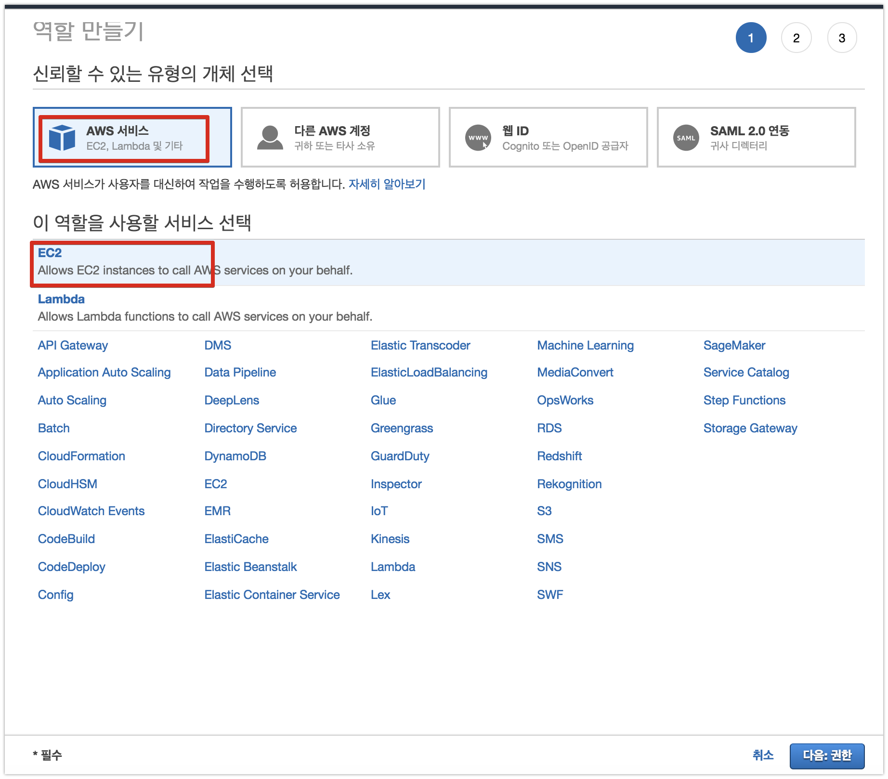

연결한 정책에는 총 4개를 선택합니다.


* AmazonS3FullAccess 
* AWSCodeDeployFullAccess 
* AWSCodeDeployRole 
* CloudWatchLogsFullAccess 

마지막 검토에는 다음과 같이 노출되어야 합니다.

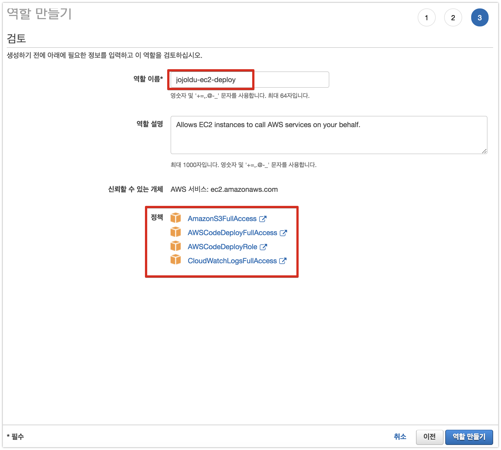

**역할 만들기**로 최종 생성하시면 아래와 같이 조회가 되면 됩니다.

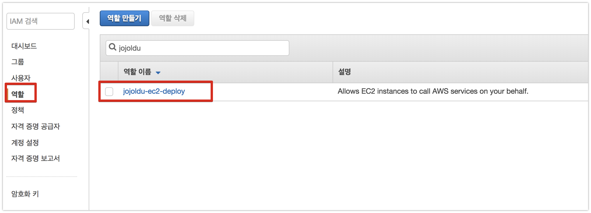

## 1-2. EC2 생성

IAM Role 생성이 끝났으니, EC2를 생성합니다.  
기본적인 과정은 기존에 하시던대로 하시면 됩니다.

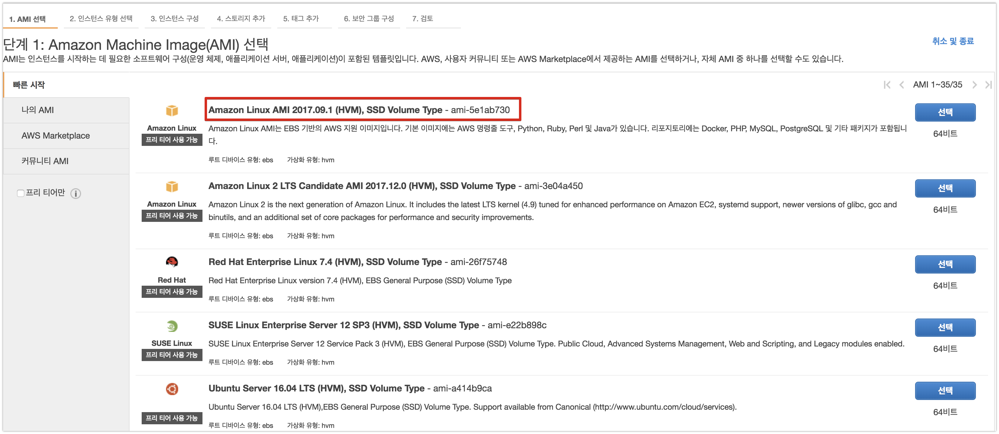


IAM 역할에선 **1-1에서 생성한 IAM Role을 선택**합니다.  
추가로, CloudWatch 모니터링도 활성화 체크 합니다.  

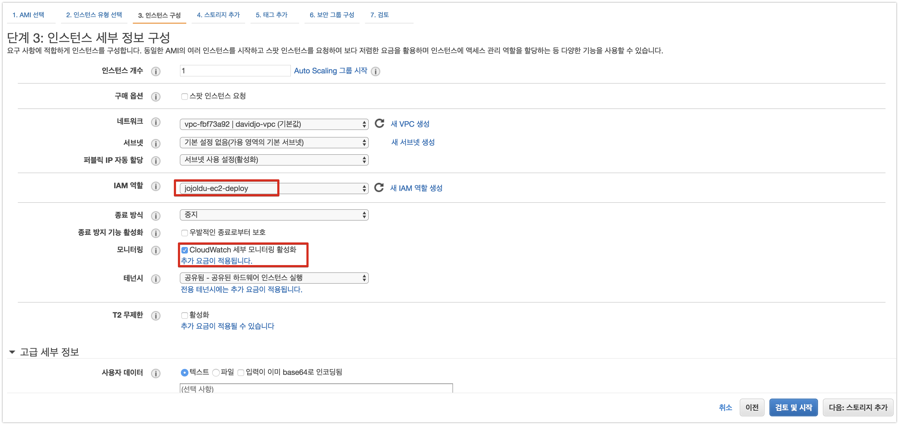

스토리지의 경우 **30GB까지가 프리티어**이기 때문에 30으로 변경합니다.


인스턴스 검색을 쉽게 하기 위해 **Name** 태그를 추가합니다.


기존에 사용하시던 키 페어가 있으시면 해당 키 페어를 사용하시고, 없으시면 새로 만듭니다.

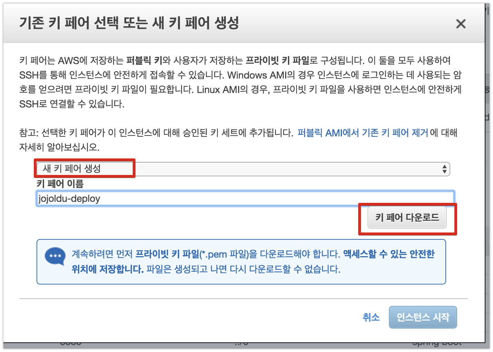

인스턴스 상태가 running으로 변경되면 EC2 생성이 완료 됩니다.


## 1-3. EC2 설정

EC2 인스턴스로 ssh 접속 후 다음의 명령어를 실행합니다.  
혹시나 pem키 접속시 아래와 같이 permission 오류가 발생하신다면, 


아래 명령어로 개인계정 read 권한만 할당합니다.

```bash
chmod 400 pem키
```

### 1-3-1. Java8 설치

EC2에 SSH 접속 되셨다면, Java8을 설치합니다.

```bash
sudo yum update
sudo yum install -y java-1.8.0-openjdk-devel.x86_64
sudo /usr/sbin/alternatives --config java
sudo yum remove java-1.7.0-openjdk
```


java 버전을 확인해봅니다.

```bash
java -version
```


그리고 ```~/build/```디렉토리를 생성합니다. 

```bash
mkdir ~/build/
```

**CodeDeploy를 통해서 배포용 파일**들을 받을 디렉토리입니다.

이외에 필요한 것들이 더 있으시면 설치하시면 됩니다.  
(스프링부트 프로젝트에는 이외에는 별도로 필요한게 없습니다.)  

### 1-3-2. Code Deploy Agent용 사용자 추가

이제 EC2가 Code Deploy 이벤트를 수신할 수 있도록 Agent를 설치해야하는데요.  
그전에 EC2에서 AWS CLI를 사용할 수 있도록, IAM 사용자를 하나 추가하겠습니다.  
IAM 사용자는 보통 IAM 정책이 적용된 그룹 생성 -> 해당 그룹에 사용자 추가로 진행합니다.  
  
그래서 그룹부터 먼저 생성하겠습니다.


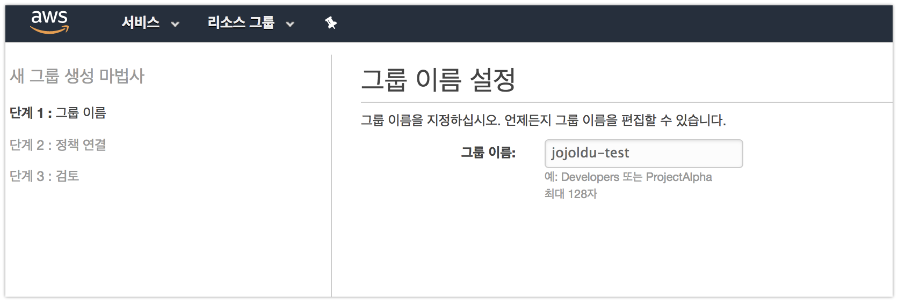

정책 선택은 아무것도 하지않고 넘깁니다.  
(정책은 이후 **JSON으로 한번에 적용**할 예정입니다.)  


그룹 생성이 완료된 후, 해당 그룹으로 이동해보시면

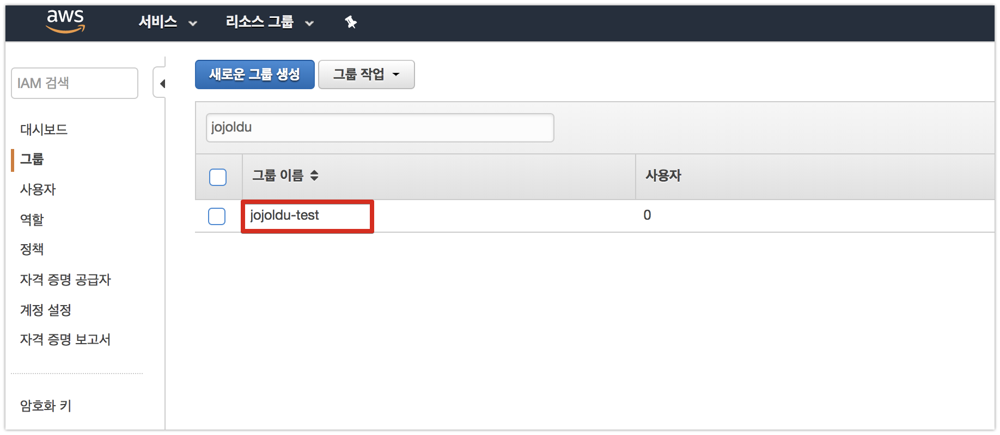

권한 -> 인라인 정책 탭을 수정합니다.


정책 문서에 하단의 JSON 코드를 그대로 추가합니다.

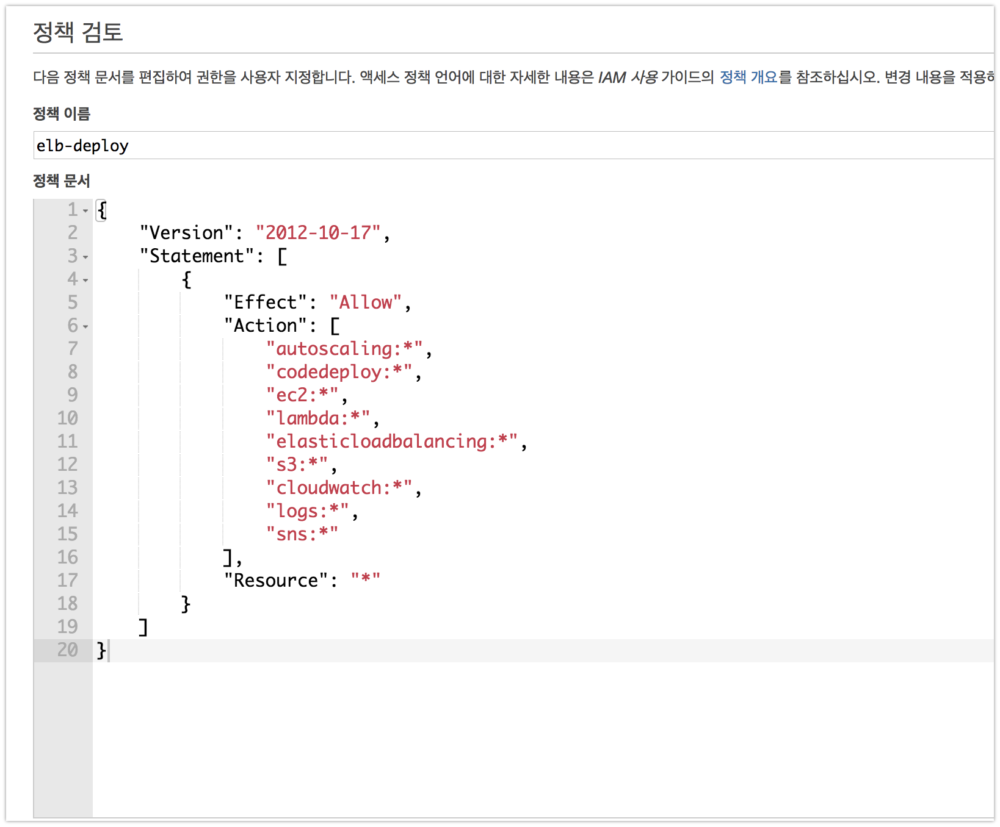

```json
{
    "Version": "2012-10-17",
    "Statement": [
        {
            "Effect": "Allow",
            "Action": [
                "autoscaling:*",
                "codedeploy:*",
                "ec2:*",
                "lambda:*",
                "elasticloadbalancing:*",
                "s3:*",
                "cloudwatch:*",
                "logs:*",
                "sns:*"
            ],
            "Resource": "*"
        }
    ]
}
```

* Version은 무조건 ```"2012-10-17"``` 만 됩니다.

정책이 성공적으로 추가됐습니다.

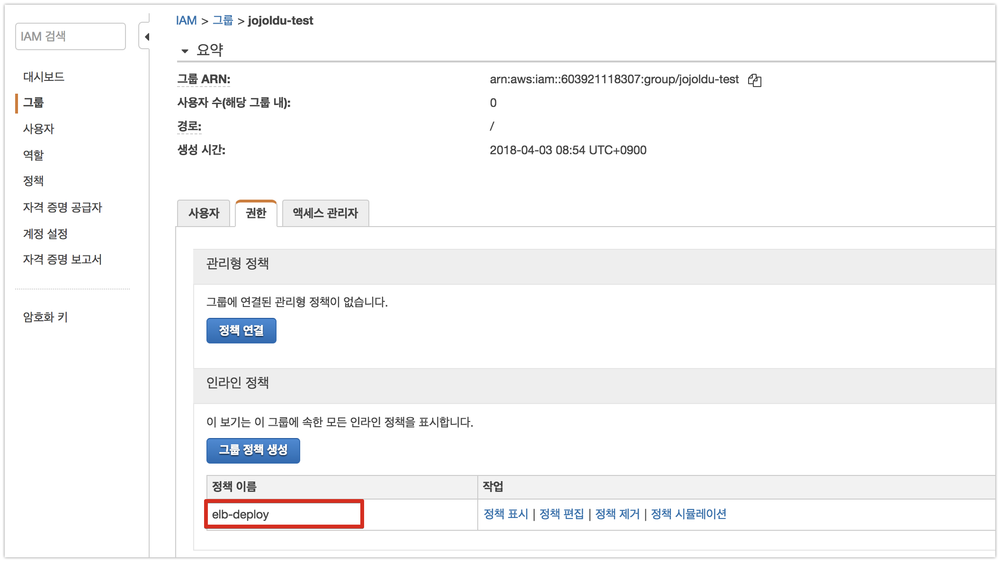

그룹 생성과 편집이 끝났으니, 적절한 사용자를 추가하겠습니다.  

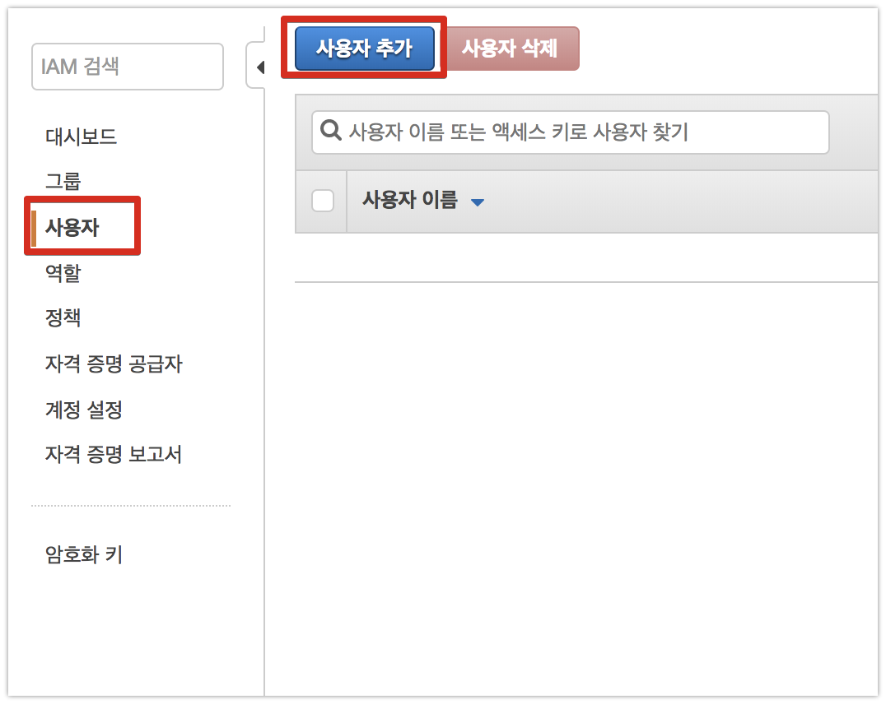


그룹에 사용자 추가하기 버튼을 클릭하신뒤, 방금 생성한 그룹을 선택합니다.


최종 사용자 생성이 완료되면, 해당 사용자를 인증할 수 있는 엑세스키가 생성됩니다.  
현재 페이지에서만 받을수 있으니, 얼른 ```.csv```를 다운받습니다.


여기까지 하셨다면 다시 EC2로 돌아가서 Code Deploy Agent를 설치하겠습니다.

### 1-3-3. EC2에 Code Deploy Agent 설치

EC2에 CodeDeploy로 지정한 위치에서 파일을 받아 실행하기 위해서는 Code Deploy Agent가 설치되있어야만 합니다.  
이를 진행하겠습니다.  
  
EC2에 접속하시고, ```aws-cli```를 먼저 설치합니다.

```bash
sudo yum install -y aws-cli
```

사용자 홈으로 이동하고 aws cli 설정을 시작합니다.

```bash
cd /home/ec2-user/ 
sudo aws configure
```


* Access Key
  * 좀전에 생성한 사용자의 엑세스키 (.csv파일에 있음)를 등록합니다.
* Secret Access Key
  * 좀전에 생성한 사용자의 시크릿키 (.csv파일에 있음)를 등록합니다.
* region name
  * ap-northeast-2
  * 서울 리전을 얘기합니다.
* output format
  * json

aws 설정이 끝나셨다면, Agent 설치파일을 다운받겠습니다.

```bash
wget https://aws-codedeploy-ap-northeast-2.s3.amazonaws.com/latest/install
```

해당 파일에 실행권한을 추가합니다.

```bash
chmod +x ./install
```

실행권한이 추가되셨다면, 설치를 진행합니다.

```bash
sudo ./install auto
```

설치가 완료되셨으면 아래 명령어로 Agent가 실행중인지 확인합니다.

```bash
sudo service codedeploy-agent status
```


마지막으로 EC2 인스턴스가 부팅되면 자동으로 AWS CodeDeploy Agent가 실행될 수 있도록 /etc/init.d/에 쉘 스크립트 파일을 하나 생성하겠습니다.

```bash
sudo vim /etc/init.d/codedeploy-startup.sh
```

스크립트 내용은 아래와 같습니다.

```bash
#!/bin/bash 
echo 'Starting codedeploy-agent' 
sudo service codedeploy-agent restart
```

스크립트 파일을 저장한뒤, 실행권한을 추가합니다.

```bash
sudo chmod +x /etc/init.d/codedeploy-startup.sh
```

EC2에 CodeDeloy Agent 설치가 완료되었습니다!  

## 1-4. Code Deploy 생성하기


