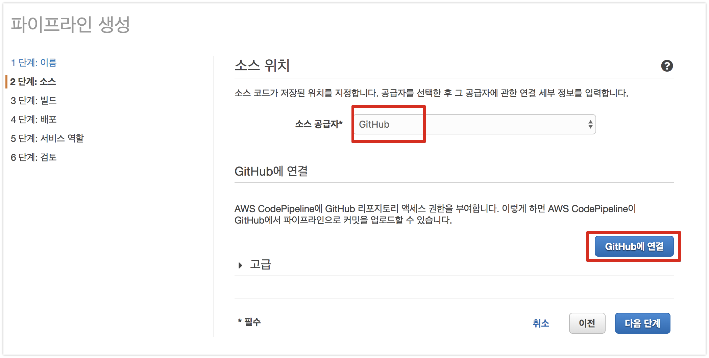
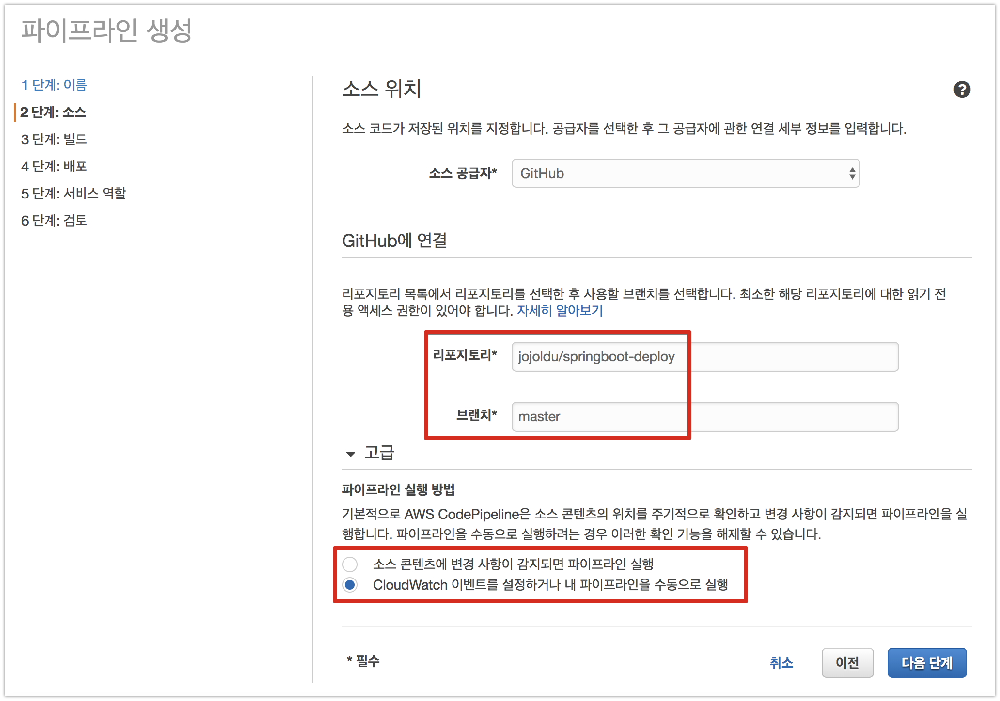
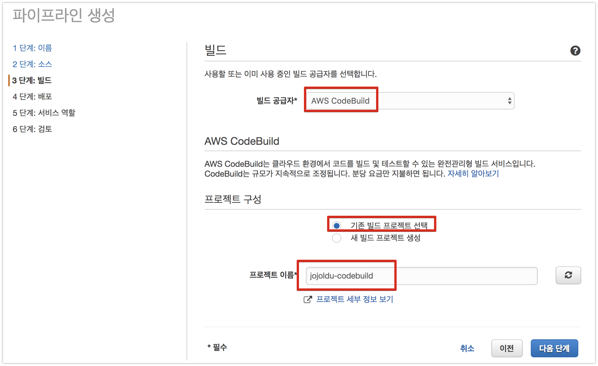
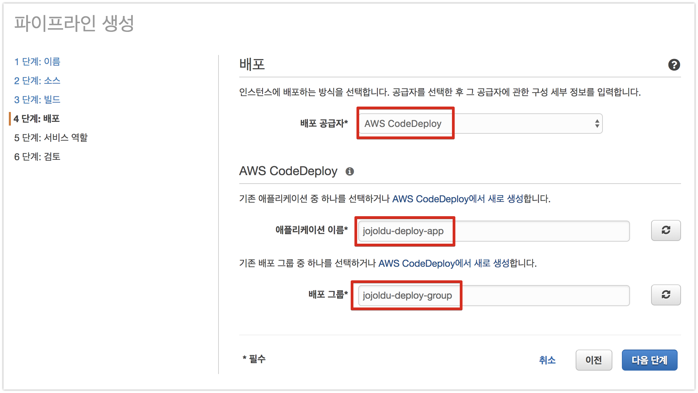
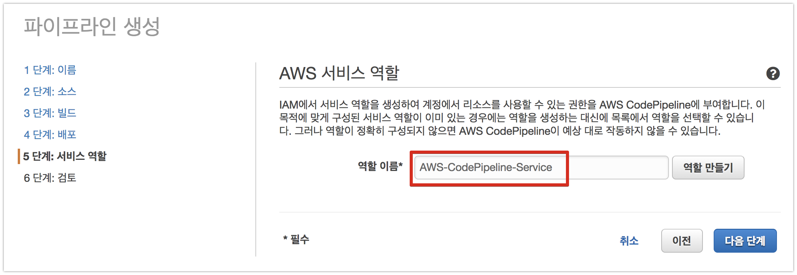

# 3. AWS Code Pipeline으로 배포하기

[지난 시간](http://jojoldu.tistory.com/281)에 Code Deploy 사용하는 방법에 대해 설명드렸습니다.  
  


## 3-1. Code Pipeline 구축하기

먼저 Code Pipeline 웹콘솔로 이동합니다.  
**파이프라인 생성**버튼을 클릭합니다.


Code Pipeline 이름을 등록합니다.


소스를 Github에 가져오도록 선택하고, **Github에 연결**을 클릭합니다.



OAuth 리다이렉트가 끝나면 리포지토리와 브랜치를 선택합니다.



여기서 고급을 보면 실행 트리거가 2개가 있음을 알 수 있습니다.  

* master 브랜치에 PUSH 발생시 자동 실행
* 파이프라인 수동 실행

이번 포스팅에선 **수동 실행**을 선택하겠습니다.  









배포하기 전에 Code Deploy로 채워진 ```~/build/``` 디렉토리를 싹 비우겠습니다.

```bash
sudo rm -rf ~/build/*
```

